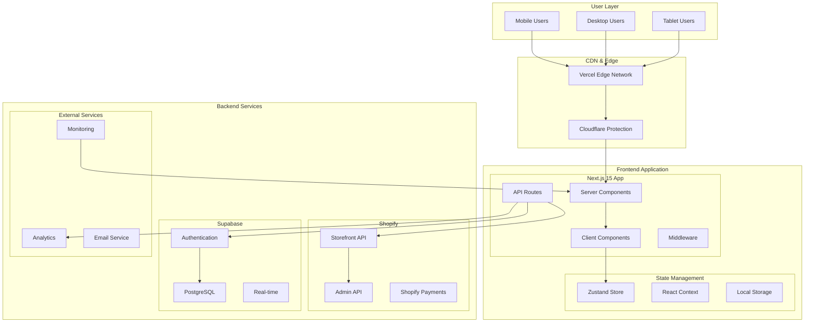
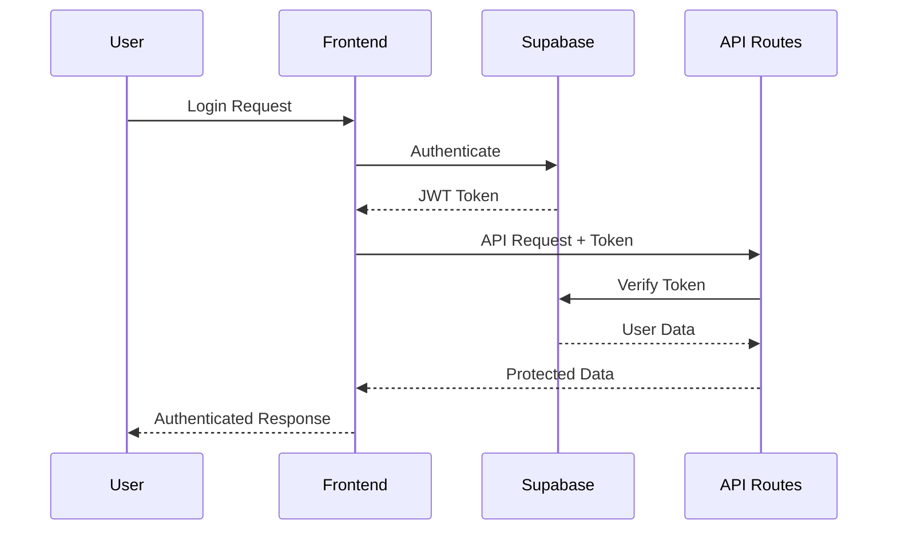

# Architecture Overview

> **Comprehensive architectural documentation for the Strike Shop e-commerce platform**

## 📋 Table of Contents

- [System Architecture](./system-architecture.md) - High-level system design
- [Component Architecture](./component-architecture.md) - Frontend component organization
- [Data Flow](./data-flow.md) - Data management and flow patterns
- [Design System](./design-system.md) - UI/UX design principles
- [Performance Strategy](./performance.md) - Performance optimization approach

## 🏗️ Architectural Philosophy

Strike Shop follows a **modern, performance-first architecture** built on these core principles:

### **1. Server-First Approach**
- **React Server Components** for optimal performance
- **Minimal client-side JavaScript** for faster load times
- **Edge computing** with Vercel for global performance
- **Static generation** where possible with ISR for dynamic content

### **2. Headless Commerce**
- **Shopify Storefront API** for product and order management
- **Decoupled frontend** for maximum flexibility
- **API-first design** for future integrations
- **Microservices architecture** for scalability

### **3. Type-Safe Development**
- **End-to-end TypeScript** with strict configuration
- **Runtime validation** with Zod schemas
- **API contract validation** for external services
- **Component prop validation** for reliability

### **4. Performance Optimization**
- **Bundle optimization** with code splitting
- **Image optimization** with Next.js Image
- **Caching strategies** at multiple levels
- **Core Web Vitals** optimization

## 🏛️ High-Level Architecture



## 🎯 Core Design Principles

### **1. Mobile-First Development**
- **Responsive design** starting from 320px width
- **Touch-optimized** interactions with haptic feedback
- **Progressive enhancement** for larger screens
- **Performance budgets** prioritizing mobile experience

### **2. Accessibility-First**
- **WCAG 2.1 AA compliance** as baseline requirement
- **Semantic HTML** with proper ARIA attributes
- **Keyboard navigation** for all interactive elements
- **Screen reader optimization** with meaningful content structure

### **3. Performance-Driven**
- **Lighthouse score >90** for all core metrics
- **Bundle size optimization** with dynamic imports
- **Image optimization** with WebP/AVIF formats
- **Critical rendering path** optimization

### **4. Security-Focused**
- **Zero-trust architecture** with validation at every layer
- **Content Security Policy** with strict directives
- **HTTPS everywhere** with security headers
- **Input validation** with server-side verification

## 🔧 Technology Stack

### **Frontend Core**
```typescript
// Next.js 15 with App Router
export default function Layout({ children }) {
  return (
    <html lang="en">
      <body className="font-sans antialiased">
        <Providers>
          {children}
        </Providers>
      </body>
    </html>
  );
}
```

### **State Management**
```typescript
// Zustand for global state
export const useCartStore = create<CartState>((set, get) => ({
  items: [],
  addItem: (item) => set((state) => ({
    items: [...state.items, item]
  })),
  // ... other actions
}));
```

### **Styling & Components**
```typescript
// Tailwind CSS + shadcn/ui
import { Button } from "@/components/ui/button";
import { cn } from "@/lib/utils";

export function ProductCard({ className, ...props }) {
  return (
    <div className={cn("border rounded-lg p-4", className)}>
      {/* Component content */}
    </div>
  );
}
```

## 📱 Component Architecture

### **Component Hierarchy**
```
├── App Router Pages (Server Components)
│   ├── Global Layout
│   ├── Route Layouts
│   └── Page Components
├── Shared Components
│   ├── UI Primitives (shadcn/ui)
│   ├── Business Components
│   └── Feature Components
├── Client Components (Minimal)
│   ├── Interactive Forms
│   ├── Real-time Features
│   └── Browser API Usage
└── Utilities & Hooks
    ├── Custom Hooks
    ├── Utilities
    └── Type Definitions
```

### **Component Types**

**Server Components (Default)**
- Product listings and details
- Category pages
- Static content
- SEO-optimized pages

**Client Components (When Needed)**
- Shopping cart interactions
- User authentication forms
- Real-time updates
- Browser API usage

**Hybrid Patterns**
```typescript
// Server Component wrapper
export default async function ProductPage({ params }) {
  const product = await getProduct(params.slug);
  
  return (
    <div>
      <ProductDetails product={product} /> {/* Server Component */}
      <AddToCartButton productId={product.id} /> {/* Client Component */}
    </div>
  );
}
```

## 🔄 Data Flow Architecture

### **Data Sources**
1. **Shopify Storefront API** - Products, collections, cart, checkout
2. **Supabase** - User profiles, reviews, wishlist
3. **Local Storage** - Temporary state, preferences
4. **Session Storage** - Cart recovery, form data

### **Data Flow Patterns**

**Server-Side Data Fetching**
```typescript
// RSC data fetching
export default async function HomePage() {
  const [products, categories] = await Promise.all([
    getProducts({ limit: 12 }),
    getCategories()
  ]);

  return (
    <div>
      <HeroSection />
      <ProductGrid products={products} />
      <CategoryNav categories={categories} />
    </div>
  );
}
```

**Client-Side State Management**
```typescript
// Real-time cart updates
export function useCart() {
  const store = useCartStore();
  
  const addItem = async (item: CartItem) => {
    // Optimistic update
    store.addItem(item);
    
    try {
      // Sync with Shopify
      await cartApi.addItem(item);
    } catch (error) {
      // Rollback on failure
      store.removeItem(item.id);
      throw error;
    }
  };

  return { addItem, ...store };
}
```

## 🚀 Performance Architecture

### **Loading Strategies**
1. **Critical Path** - Inline critical CSS, defer non-critical
2. **Progressive Loading** - Load above-the-fold first
3. **Code Splitting** - Route-based and component-based
4. **Resource Prioritization** - Preload critical resources

### **Caching Layers**
```typescript
// Multiple caching strategies
export const config = {
  // Static pages - cache forever
  '/': { cache: 'force-cache', revalidate: false },
  
  // Product pages - ISR with revalidation
  '/product/[slug]': { revalidate: 3600 }, // 1 hour
  
  // Dynamic content - fresh data
  '/cart': { cache: 'no-store' },
  
  // API routes - with tags for on-demand revalidation
  '/api/products': { 
    cache: 'force-cache',
    tags: ['products']
  }
};
```

### **Bundle Optimization**
```typescript
// Dynamic imports for large components
const Chart = dynamic(() => import('@/components/ui/chart'), {
  loading: () => <ChartSkeleton />,
  ssr: false
});

// Route-based code splitting
const AdminDashboard = dynamic(() => import('@/components/admin/dashboard'));
```

## 🛡️ Security Architecture

### **Authentication Flow**


### **Security Layers**
1. **Input Validation** - Zod schemas at API boundaries
2. **Authentication** - JWT with Supabase
3. **Authorization** - Role-based access control
4. **CSRF Protection** - Double-submit cookies
5. **Rate Limiting** - API route protection
6. **Content Security Policy** - XSS prevention

## 📊 Monitoring & Observability

### **Monitoring Stack**
- **Error Tracking** - Comprehensive error reporting
- **Performance Monitoring** - Core Web Vitals tracking
- **Business Analytics** - User behavior and conversion tracking
- **Infrastructure Monitoring** - Server and CDN performance

### **Observability Patterns**
```typescript
// Structured logging
export function logEvent(event: string, data?: Record<string, any>) {
  console.log(JSON.stringify({
    timestamp: new Date().toISOString(),
    event,
    data,
    userAgent: navigator.userAgent,
    url: window.location.href
  }));
}

// Performance monitoring
export function withPerformanceMonitoring<T>(
  fn: () => Promise<T>,
  operationName: string
): Promise<T> {
  const start = performance.now();
  
  return fn().finally(() => {
    const duration = performance.now() - start;
    logEvent('performance', {
      operation: operationName,
      duration,
      timestamp: start
    });
  });
}
```

## 🔄 Development Workflow

### **Code Organization**
```
├── app/                    # Next.js App Router
│   ├── (routes)/          # Route groups
│   ├── api/               # API routes
│   └── globals.css        # Global styles
├── components/            # Reusable components
│   ├── ui/               # Base UI components
│   ├── features/         # Feature-specific components
│   └── layout/           # Layout components
├── lib/                  # Utilities and configurations
│   ├── api/              # API clients
│   ├── stores/           # State management
│   └── utils/            # Helper functions
├── types/                # TypeScript definitions
└── docs/                 # Documentation
```

### **Quality Assurance**
```typescript
// Type safety with strict TypeScript
{
  "compilerOptions": {
    "strict": true,
    "noUncheckedIndexedAccess": true,
    "exactOptionalPropertyTypes": true
  }
}

// Runtime validation with Zod
const ProductSchema = z.object({
  id: z.string(),
  title: z.string(),
  price: z.number().positive(),
  available: z.boolean()
});

// Testing with comprehensive coverage
describe('ProductCard', () => {
  it('renders product information correctly', () => {
    render(<ProductCard product={mockProduct} />);
    expect(screen.getByText(mockProduct.title)).toBeInTheDocument();
  });
});
```

## 🎯 Future Architecture Considerations

### **Scalability Enhancements**
- **Micro-frontend architecture** for team independence
- **GraphQL federation** for unified API layer
- **Edge computing** for global performance
- **Containerization** for deployment flexibility

### **Advanced Features**
- **Real-time capabilities** with WebSockets
- **Offline functionality** with service workers
- **AI/ML integration** for personalization
- **Multi-tenant architecture** for white-labeling

### **Performance Optimizations**
- **Streaming SSR** for faster perceived performance
- **Selective hydration** for reduced JavaScript
- **Edge-side includes** for partial page caching
- **Predictive prefetching** based on user behavior

---

## 📚 Architecture Decision Records

All major architectural decisions are documented in:
- [ADR-001: Next.js 15 App Router Migration](./decisions/adr-001-nextjs-app-router.md)
- [ADR-002: Shopify Headless Commerce](./decisions/adr-002-shopify-headless.md)
- [ADR-003: State Management Strategy](./decisions/adr-003-state-management.md)
- [ADR-004: Component Architecture](./decisions/adr-004-component-architecture.md)

## 🔗 Related Documentation

- [Implementation Guides](../05-implementation-guides/) - How to implement features
- [Best Practices](../06-best-practices/) - Coding standards and guidelines
- [Component Documentation](../07-component-docs/) - Component usage and APIs
- [API Documentation](../08-api-docs/) - API specifications and examples

---

*This architecture serves as the foundation for all development decisions and should be consulted before making significant changes to the system.*

**Last Updated**: 2024-12-30  
**Next Review**: 2025-01-15  
**Architecture Version**: 2.0