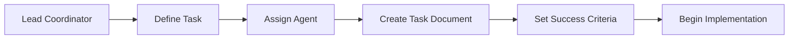
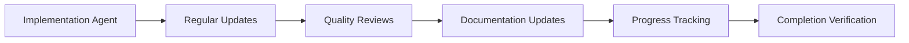
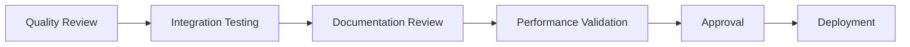

# Subagent Coordination Hub

> **Central coordination system for multi-agent refactoring tasks**

## 📋 Table of Contents

- [Coordination Standards](./standards.md) - Communication and task standards
- [Task Templates](./task-templates.md) - Standardized task documentation
- [Communication Protocols](./communication.md) - Inter-agent communication
- [Progress Tracking](./progress-tracking.md) - Real-time progress monitoring
- [Quality Assurance](./quality-assurance.md) - Quality standards and reviews

## 🎯 Purpose

This coordination system enables multiple AI agents to work together effectively on the Strike Shop refactoring project. It provides:

1. **Standardized Communication** - Clear protocols for agent interaction
2. **Task Management** - Structured approach to task assignment and completion
3. **Progress Tracking** - Real-time visibility into project status
4. **Quality Assurance** - Consistent standards across all deliverables
5. **Knowledge Sharing** - Centralized learning and best practices

## 🤖 Agent Roles

### **Lead Coordinator Agent**
- **Primary Responsibility**: Overall project coordination and decision-making
- **Key Tasks**: Architecture decisions, task prioritization, quality oversight
- **Communication**: Daily status updates, weekly planning sessions
- **Deliverables**: Master plan updates, progress reports, architectural documentation

### **Architecture Agent**
- **Primary Responsibility**: System design and architectural decisions
- **Key Tasks**: Component design, data flow planning, performance optimization
- **Communication**: Architecture reviews, design proposals, technical specifications
- **Deliverables**: Architecture diagrams, component specifications, performance guidelines

### **Implementation Agent**
- **Primary Responsibility**: Code implementation and component development
- **Key Tasks**: Component creation, API integration, feature implementation
- **Communication**: Implementation updates, code reviews, testing results
- **Deliverables**: Working code, unit tests, component documentation

### **Quality Assurance Agent**
- **Primary Responsibility**: Code quality, testing, and standards compliance
- **Key Tasks**: Code reviews, test implementation, quality metrics tracking
- **Communication**: Quality reports, issue identification, improvement recommendations
- **Deliverables**: Test suites, quality reports, compliance documentation

### **Documentation Agent**
- **Primary Responsibility**: Comprehensive documentation maintenance
- **Key Tasks**: API documentation, guides, knowledge base updates
- **Communication**: Documentation reviews, information requests, knowledge sharing
- **Deliverables**: Technical guides, API documentation, best practices

### **Performance Agent**
- **Primary Responsibility**: Performance monitoring and optimization
- **Key Tasks**: Performance testing, bottleneck identification, optimization implementation
- **Communication**: Performance reports, optimization proposals, monitoring alerts
- **Deliverables**: Performance reports, optimization guides, monitoring dashboards

## 🔄 Coordination Workflow

### **1. Task Planning Phase**

### **2. Implementation Phase**

### **3. Review & Integration Phase**

## 📊 Current Active Tasks

### **High Priority** 🔴
| Task | Agent | Status | Due Date | Progress |
|------|-------|--------|----------|----------|
| Architecture Refactoring | Architecture | In Progress | 2025-01-05 | 60% |
| Component Audit | Implementation | Planning | 2025-01-03 | 10% |
| Performance Baseline | Performance | Not Started | 2025-01-07 | 0% |

### **Medium Priority** 🟡
| Task | Agent | Status | Due Date | Progress |
|------|-------|--------|----------|----------|
| API Documentation | Documentation | In Progress | 2025-01-10 | 30% |
| Test Coverage | Quality Assurance | Planning | 2025-01-08 | 5% |
| Security Audit | Quality Assurance | Not Started | 2025-01-12 | 0% |

### **Low Priority** 🟢
| Task | Agent | Status | Due Date | Progress |
|------|-------|--------|----------|----------|
| Style Guide | Documentation | Completed | 2024-12-30 | 100% |
| Monitoring Setup | Performance | Planning | 2025-01-15 | 15% |

## 🎯 Success Metrics

### **Coordination Effectiveness**
- **Task Completion Rate**: 95% of tasks completed on time
- **Communication Frequency**: Daily updates from active agents
- **Quality Score**: 90%+ quality rating for all deliverables
- **Issue Resolution Time**: Average 24-hour response time

### **Technical Metrics**
- **Code Quality**: 0 critical issues in production code
- **Test Coverage**: 90%+ for all new code
- **Performance**: All metrics within target ranges
- **Documentation**: 100% coverage for public APIs

### **Process Metrics**
- **Planning Accuracy**: 85% of estimates within 20% of actual
- **Dependency Management**: 0 blocking dependencies longer than 48 hours
- **Knowledge Sharing**: Weekly knowledge sharing sessions
- **Continuous Improvement**: Monthly process optimization reviews

## 🛠️ Tools & Resources

### **Communication Tools**
- **Task Updates**: Use standardized progress templates
- **Code Reviews**: Follow quality assurance guidelines
- **Documentation**: Maintain in structured markdown format
- **Status Reports**: Weekly consolidated reports

### **Development Tools**
- **Version Control**: Git with feature branch workflow
- **Code Quality**: ESLint, Prettier, TypeScript strict mode
- **Testing**: Jest, Playwright, React Testing Library
- **Performance**: Lighthouse, Bundle Analyzer, Core Web Vitals

### **Monitoring Tools**
- **Error Tracking**: Comprehensive error logging
- **Performance**: Real-time performance monitoring
- **Quality Metrics**: Automated quality reporting
- **Progress Tracking**: Real-time dashboard updates

## 📋 Standard Operating Procedures

### **Daily Standup Protocol**
1. **What was accomplished yesterday?**
2. **What is planned for today?**
3. **Are there any blockers or dependencies?**
4. **Any requests for help or collaboration?**

### **Task Handoff Protocol**
1. **Complete task documentation update**
2. **Run all quality checks**
3. **Update progress tracking**
4. **Notify receiving agent**
5. **Conduct knowledge transfer if needed**

### **Quality Gate Protocol**
1. **Code review by QA agent**
2. **Automated testing validation**
3. **Performance impact assessment**
4. **Documentation review**
5. **Approval from lead coordinator**

## 🔄 Continuous Improvement

### **Weekly Retrospectives**
- **What went well this week?**
- **What could be improved?**
- **Any process changes needed?**
- **Knowledge sharing opportunities?**

### **Monthly Process Reviews**
- **Coordination effectiveness analysis**
- **Tool and process optimization**
- **Agent role refinement**
- **Success metric evaluation**

### **Quarterly Strategic Reviews**
- **Overall project progress assessment**
- **Role and responsibility adjustments**
- **Technology and tool upgrades**
- **Long-term planning updates**

---

## 🎨 Templates & Standards

All agents should use the standardized templates available in:
- [Task Templates](./task-templates.md) - For all task documentation
- [Communication Templates](./communication.md) - For status updates and reports
- [Quality Standards](./quality-assurance.md) - For code and documentation quality

## 📞 Escalation Procedures

### **Technical Issues**
1. **Level 1**: Individual agent resolution (2 hours)
2. **Level 2**: Collaborate with relevant specialist agent (8 hours)
3. **Level 3**: Escalate to lead coordinator (24 hours)
4. **Level 4**: External expert consultation (48 hours)

### **Process Issues**
1. **Minor**: Direct agent communication
2. **Major**: Lead coordinator involvement
3. **Critical**: Immediate team escalation

### **Quality Issues**
1. **Code Quality**: QA agent review and remediation
2. **Performance**: Performance agent analysis and optimization
3. **Documentation**: Documentation agent review and updates

---

*Last updated: 2024-12-30*  
*Next review: 2025-01-02*