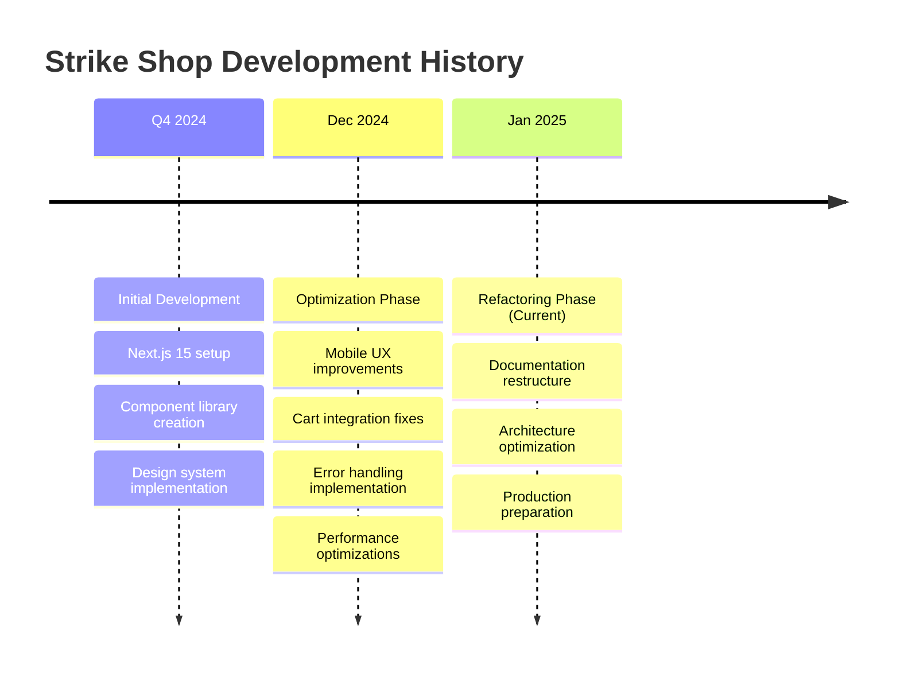

# Legacy Documentation Archive

> **Historical documentation and implementation records for the Strike Shop project**

## 📋 Table of Contents

- [Implementation Summaries](./summaries/) - Completed implementation records
- [Migration Records](./migrations/) - API and system migration documentation
- [Deprecated Features](./deprecated/) - Removed or obsolete features
- [Archive](./archive/) - Historical versions and outdated documentation

## 🎯 Purpose

This directory contains historical documentation that provides context for the current refactoring effort. While these documents are no longer active guidelines, they contain valuable information about:

1. **Implementation History** - What was built and why
2. **Technical Decisions** - Past architectural choices and their rationale
3. **Migration Patterns** - How systems were evolved over time
4. **Lessons Learned** - Insights from previous development phases

## 📚 Document Categories

### **Implementation Summaries** (`/summaries/`)
Records of completed implementations, optimizations, and fixes.

| Document | Date | Summary | Status |
|----------|------|---------|--------|
| [Mobile Touch Optimization](./summaries/MOBILE_TOUCH_OPTIMIZATION_SUMMARY.md) | 2024-12-30 | Mobile touch interaction improvements | ✅ Implemented |
| [Mobile UX Audit](./summaries/MOBILE_UX_AUDIT_AND_PLAN.md) | 2024-12-30 | Mobile user experience analysis and fixes | ✅ Implemented |
| [Component Audit](./summaries/client-server-component-audit.md) | 2024-12-30 | React component optimization analysis | 📚 Reference |
| [Design System Optimization](./summaries/design-system-optimization-plan.md) | 2024-12-30 | Design token and CSS optimization plan | 📚 Reference |
| [Cart Integration Fix](./summaries/CART_INTEGRATION_FIX_SUMMARY.md) | 2024-12-30 | Shopify cart integration implementation | ✅ Implemented |
| [Error Handling Implementation](./summaries/ERROR_HANDLING_IMPLEMENTATION_SUMMARY.md) | 2024-12-30 | Comprehensive error handling system | ✅ Implemented |
| [DevOps Best Practices](./summaries/DEVOPS_BEST_PRACTICES.md) | 2024-12-30 | Production deployment checklist | 📚 Reference |
| [Production Readiness Plan](./summaries/PRODUCTION_READINESS_PLAN.md) | 2024-12-30 | Comprehensive production preparation | 📚 Reference |
| [Scroll Fix Summary](./summaries/SCROLL_FIX_SUMMARY.md) | 2024-12-30 | Mobile scroll interaction fixes | ✅ Implemented |
| [Shopify Integration](./summaries/SHOPIFY_INTEGRATION.md) | 2024-12-30 | Headless commerce implementation guide | 📚 Reference |

### **Migration Records** (`/migrations/`)
Documentation of system migrations and API changes.

| Document | Date | Summary | Relevance |
|----------|------|---------|-----------|
| [Cart API Migration](./migrations/cart-api-migration.md) | 2024-12-30 | Client to server-side cart migration | 📚 Reference |
| [Design System Migration](./migrations/design-system-migration-guide.md) | 2024-12-30 | Design token migration guide | 📚 Reference |

### **Deprecated Features** (`/deprecated/`)
*Currently empty - will contain documentation for removed features*

### **Archive** (`/archive/`)
*Currently empty - will contain historical versions of documentation*

## 🔍 Key Insights from Legacy Documentation

### **Mobile Optimization Lessons**
From the mobile optimization summaries, key learnings include:
- **Touch targets must be ≥48px** for optimal usability
- **Touch-action CSS properties** need careful coordination
- **Scroll event propagation** can conflict with touch interactions
- **Haptic feedback** enhances mobile user experience

### **Component Architecture Evolution**
The component audit revealed:
- **168 total components** with optimization opportunities
- **112 components** can be converted to Server Components
- **56 components** legitimately need client-side functionality
- **Performance gains** of 30-40% possible with proper optimization

### **Shopify Integration Approach**
The integration documentation shows:
- **Headless commerce** chosen over traditional Shopify themes
- **Storefront API** used for frontend data access
- **Cart persistence** requires careful state synchronization
- **Security considerations** for API key management

### **Design System Maturity**
Design system documentation indicates:
- **Strong foundation** with Tailwind CSS and shadcn/ui
- **Inconsistent token usage** needs systematic cleanup
- **Performance optimization** opportunities in CSS bundle
- **Accessibility compliance** already well-established

## 📊 Implementation Timeline

## 🔄 Migration from Legacy to Current

### **What Has Changed**
1. **Documentation Structure**: Moved from scattered files to organized sections
2. **Planning Approach**: From ad-hoc to systematic phase-based refactoring
3. **Agent Coordination**: Introduced multi-agent collaboration system
4. **Quality Standards**: Established comprehensive quality gates

### **What Remains Relevant**
1. **Technical Implementations**: Mobile optimizations, cart fixes, error handling
2. **Architecture Decisions**: Component choices, API integrations, security patterns
3. **Performance Insights**: Bundle optimization, caching strategies, image handling
4. **Best Practices**: Accessibility standards, mobile-first approach, TypeScript usage

### **What Has Been Superseded**
1. **Planning Documents**: Replaced by [Master Refactoring Plan](../03-refactoring-plans/master-plan.md)
2. **Implementation Guides**: Replaced by [Implementation Guides](../05-implementation-guides/)
3. **Best Practices**: Consolidated into [Best Practices](../06-best-practices/)
4. **Architecture Docs**: Updated in [Architecture](../02-architecture/)

## 📚 Usage Guidelines

### **When to Reference Legacy Docs**
- **Understanding implementation history** and why decisions were made
- **Learning from past optimization efforts** and their results
- **Reviewing migration patterns** for similar future changes
- **Understanding the evolution** of the codebase architecture

### **When NOT to Use Legacy Docs**
- **Current development guidelines** - use the new structured docs
- **API implementations** - follow current API documentation
- **Component creation** - use current component guidelines
- **Testing approaches** - follow current testing standards

### **Integration with Current Docs**
Legacy documents are referenced in current documentation where relevant:
- **Architecture decisions** reference historical context
- **Performance optimizations** build on previous efforts
- **Component designs** consider past implementation patterns
- **Security implementations** extend existing patterns

## 🔗 Cross-References

### **Legacy → Current Documentation Mapping**

| Legacy Document | Current Location | Notes |
|----------------|------------------|--------|
| Mobile Touch Optimization | [Mobile Best Practices](../06-best-practices/mobile.md) | Patterns integrated |
| Component Audit | [Component Architecture](../02-architecture/component-architecture.md) | Analysis updated |
| Production Readiness | [Deployment Guide](../09-deployment/) | Expanded scope |
| DevOps Practices | [Implementation Guides](../05-implementation-guides/) | Integrated patterns |
| Design System Plans | [Design System](../02-architecture/design-system.md) | Current standards |

### **Frequently Referenced Legacy Docs**
1. **Mobile Touch Optimization Summary** - For understanding mobile interaction patterns
2. **Component Audit** - For component optimization reference
3. **Production Readiness Plan** - For deployment preparation insights
4. **Cart Integration Fix** - For Shopify integration patterns

## 📅 Maintenance

### **Archive Schedule**
- **Quarterly Review**: Assess relevance of legacy documents
- **Annual Archive**: Move outdated documents to deep archive
- **Version Control**: Maintain git history for all legacy documents
- **Index Updates**: Keep this index current with new additions

### **Retention Policy**
- **Implementation Summaries**: Keep indefinitely for historical reference
- **Migration Records**: Keep until superseded by new migrations
- **Deprecated Features**: Keep for 2 years after deprecation
- **Archived Versions**: Keep major versions permanently

---

## 📞 Support

If you need clarification on any legacy documentation:
1. **Check current docs first** - the information may have been updated
2. **Review cross-references** - find the current equivalent
3. **Ask the team** - team members can provide historical context
4. **Create an issue** - if documentation is missing or unclear

---

*This legacy archive preserves the development history and provides context for the ongoing refactoring effort. While these documents are no longer active guidelines, they represent valuable institutional knowledge.*

**Archive Established**: 2024-12-30  
**Last Updated**: 2024-12-30  
**Next Review**: 2025-03-30